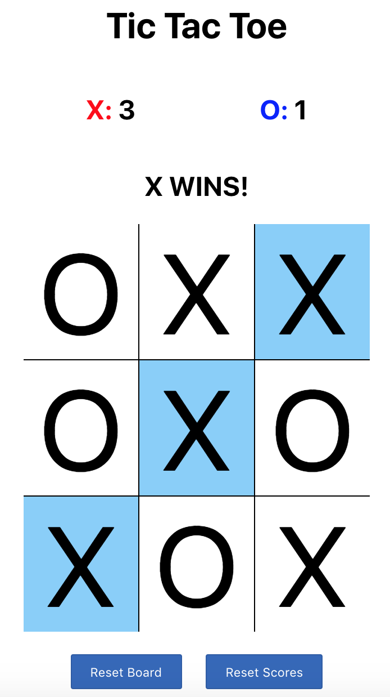

# Tic Tac Toe in React!

This project was designed to be a coding challenge. Originally I did this in an hour or so in [Vanilla JavaScript](https://codepen.io/cyippiy/pen/JQRpYz?editors=1111) (with minimal styling) but decided to make a React version. 



## Getting Started
---
In the project directory, you can run:

### `npm start`

Open [http://localhost:3000](http://localhost:3000) to view it in the browser.

**Alternatively**:
You can visit an uploaded [Codepen](https://codepen.io/cyippiy/project/full/ArWPnW) project if you don't want to download it.

*Warning*: Codepen is buggy at times so it may not function 100% there.

## Features:
---
* Built with React.js Components
* Scoreboard for Xs and Os
* Reset button to reset board
* Reset scores button to reset the score

## Design Philisophy
---
When I was brainstorming how to tackle this problem, I knew I wanted to have a state for the board and keep track of everything, from the board array, the turn count, and the logic for the game.

I originally intended to keep it simple and demonstrate my ability to pass down props from parent componets to child components by having a `Space` component. In hindsight, it seemed unnecessary for `Space` to have it's own state, store from props, when it will be constantly passed down from the `Board` component. Every time the spaces changed and the turn count incremented, `componentDidUpdate` would catch the update and re-evaluate the `checkWinner()`. Without this, you would require an additional click for the winner to be declared.
## Code Samples
---
One of the things I did was break down the process for checking the win conditions for `checkWinner()`. I used `checkRowWinner` to take a single array and check if all values are the same. Then I used a cool `transpose` method, found via [StackOverflow](https://stackoverflow.com/users/583651/fawad-ghafoor),and reused `checkRowWinner` again for `checkColWinner` to check for a column win.

Once I checked for all 3 win conditions, I see if it returns false, else it will return the coordinates of the winning spaces and rerendered with the appropriate styling.
```
function transpose(matrix) {
    return matrix[0].map((col, i) => matrix.map(row => row[i]));
}

checkRowWinner(arr) {
    if (arr[0] === -1) return false;
    if (arr[0] === arr[1] && arr[1] === arr[2]) {
        return true;
    }
    return false;
}

checkColWinner(board) {
    let copyBoard = transpose(board)
    for (let i = 0; i < board.length; i++) {
        if (this.checkRowWinner(copyBoard[i])) {
            return [`0-${i}`, `1-${i}`, `2-${i}`];
        }
    }
    return false;
}

checkDiagonalWinner(board) {
    if (board[1][1] === -1) return false;
    if (board[0][0] === board[1][1] && board[1][1] === board[2][2]) {
        return ["0-0", "1-1", "2-2"];
    } else if (board[0][2] === board[1][1] && board[1][1] === board[2][0]) {
        return ["0-2", "1-1", "2-0"];
    }
    return false;
}

checkWinner() {
    let winner = null;
    let diagonal = this.checkDiagonalWinner(this.state.board);
    let col = this.checkColWinner(this.state.board);
    let coordinates;
    if (diagonal) {
        winner = diagonal;
    } else if (col) {
        winner = col;
    } else {
        for (let i = 0; i < this.state.board.length; i++) {
            if (this.checkRowWinner(this.state.board[i])) {
                winner = [`${i}-0`, `${i}-1`, `${i}-2`];
            }
        }
    }
    if (winner) {
        if (this.state.gameOver === false) {
            coordinates = winner[0].split("-");
            this.updateScore(this.state.board[coordinates[0]][coordinates[1]]);
            this.updateWinnerBoard(winner);
        }
        this.setState({
            gameOver: true
        });
    } else if (this.state.turnCount === 9 && this.state.gameOver === false) {
        this.setState({
            gameOver: true
        });
    }
}
```

## Credits
---
Again, wanted to give a big thanks to SO user [fawad-ghafoor](https://stackoverflow.com/users/583651/fawad-ghafoor) for the cool one liner. App Academy for providing me with the foundation for web development, particularly for Ruby on Rails, JavaScript, and React.js.